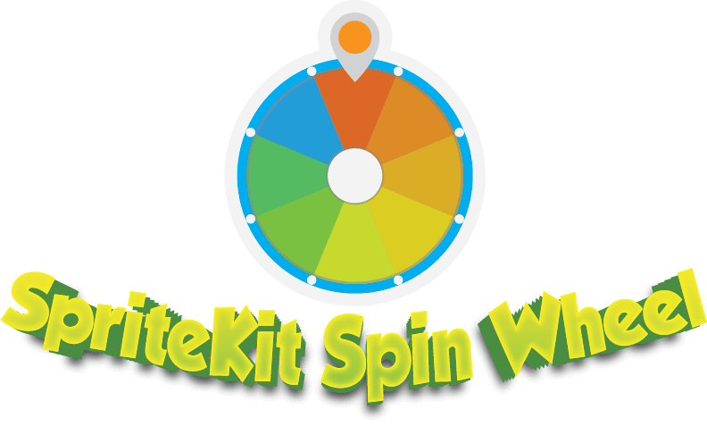
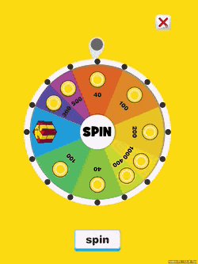
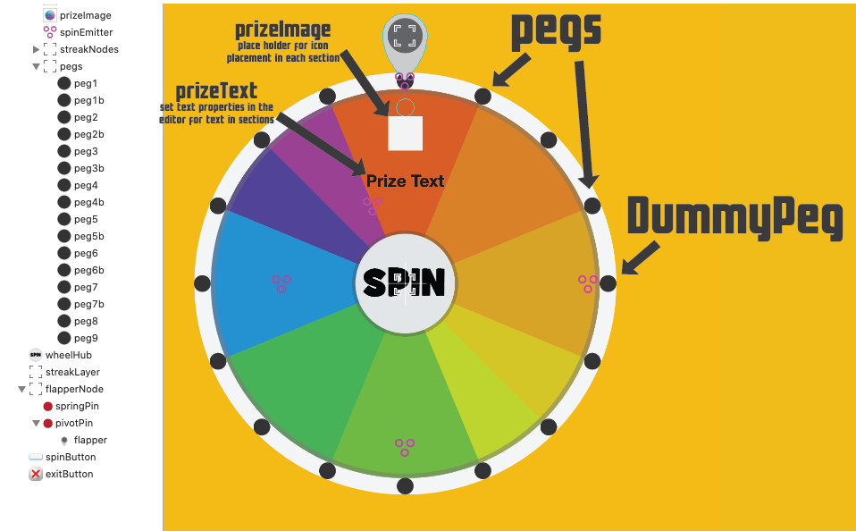

# SpriteKit Spinning Prize Wheel 2

SpriteKit Spinning prize wheel

SpriteKit Prize Wheel is a physics based spinning prize wheel with a real moving peg flapper to create an awesome looking effect. You can have your users push the spin button in the center of the wheel to spin the wheel or create a seperate button to start the spinning fun. Use it to reward your users with daily prizes, trivia games, control chance situations or for gambling type games.

Spin Wheel 2 is now completely laid out in the Xcode editor. If you are looking for one constructed entirely in code please see our [SpinWheel](https://github.com/hsilived/SpinWheel/) repo. The wheel being laid out in the editor allows you to create wheels with any number of sections, wheels with section sizes that are not all equal, define where the wheel pegs are placed and apply actions and emitters right to the wheel visually.

## SKControlSprite Install Instructions

copy the SpinWheel folder into your project

Your scene must conform to SKPhysicsContactDelegate

    class GameScene: SKScene, SKPhysicsContactDelegate {

        private var spinWheelOpen = false
        
        override func didMove(to view: SKView) {
            self.physicsWorld.contactDelegate = self
        }
    }

Add the following snippets to your scene to open a copy of the SpinWheel 

    func displaySpinWheel() {
    
        //load the prize info from a plist in the resources folder
        Prizes.loadPrizes(file: "Prizes")
        
        if let spinWheel = SKReferenceNode(fileNamed: "SpinWheel")!.getBaseChildNode() as? SpinWheel {
            
            spinWheel.removeFromParent()
            self.spinWheel = spinWheel
            spinWheel.zPosition = 100
            //you can optionally set whether or not the center hub acts as a button here or in settings
            //spinWheel.hubSpinsWheel = false
            //you can optionally set the direction the wheel spins here or in settings (default is clockwise)
            //spinWheel.spinDirection = .counterClockwise
            spinWheel.spinWheelDelegate = self
            addChild(spinWheel)
            
            spinWheel.initPhysicsJoints()
            
            spinWheelOpen = true
        }
    }
    
    //sends the physics contacts to the spinwheel to handle
    func didBegin(_ contact: SKPhysicsContact) {
    
        if spinWheelOpen {
            spinWheel.didBegin(contact)
        }
    }
    
    //sends the updates to the spinwheel to update inside the class
    override func update(_ currentTime: TimeInterval) {
    
        if spinWheelOpen {
            spinWheel.updateWheel(currentTime)
        }
    }

## Settings.swift

Inside of Settings.swift you can change the font or how the Spin Wheel is interacted with. Settings also has the physics category declarations. If you have multiple wheels that you want different settings for you can override each setting on each instance of SpinWheel (see the init above)

    let kGameFont: String = "Context Rounded Black SSi"

    //if you don't want the center hub to act like a spin button change this to false
    var kHubSpinsWheel = true

    //if you don't want the user to be able to swipe to spin the wheel change this to false
    var kCanSwipeToSpinWheel = true
    
    //when the wheel is almost stopped and hits a peg it will shimmy between the pegs if this is set to true
    var kWheelCanSpinBackwards = false

## To Change values on the Spin Wheel

If you want to change the number of slots or sizes of the slots change the wheel picture in the SpinWheel.sks file.

    To designate where each section of the wheel starts and ends you must have a "peg"  
    If you want additional pegs inside a section but DON'T want to start a new section you must change the class of those pegs to DummyPeg inside of the editor
    

    
To change the values for each piece of the wheel edit, add or delete from the array of dictionaries in the Prizes.plist file inside of the Resources folder.
title = string that is diplayed if you win that item
image = image name for icon in wheel section (in string format)
amount = Int value associated with prize (example if the bulk of your prizes are coins, they can all have the same image but would have different amounts 100, 200, 500)

    title = string that is diplayed if you win that item
    image = image name for icon in wheel section (in string format)
    amount = Int value associated with prize (example if the bulk of your prizes are coins, they can all have the same image but would have different amounts 100, 200, 500)
    
## To receive winnings
    
    Inside of SpinWheel.swift in the closeWinDialog() func a call will be sent out to the SpinWheel delegate which is probably going to be your scene and you can handle this anyway you want from your scene. Save the winnings in UserDefaults, add to their score, etc.

    self.spinWheelDelegate?.won(text: wonPrizeTitle, amount: wonPrizeAmount)

        
## Feedback
I am happy to provide the SpriteKit Prize Wheel, and example code free of charge without any warranty or guarantee (see license below for more info). If there is a feature missing or you would like added please email us at dev@orangethinkbox.com

If you use this code or get inspired by the idea give us a star ;) and let us know, I would love to hear about it.
    
## License
Copyright (c) 2019 Orange Think Box

Permission is hereby granted, free of charge, to any person obtaining a copy of this software and associated documentation files (the "Software"), to deal in the Software without restriction, including without limitation the rights to use, copy, modify, merge, publish, distribute, sublicense, and/or sell copies of the Software, and to permit persons to whom the Software is furnished to do so, subject to the following conditions:

The above copyright notice and this permission notice shall be included in all copies or substantial portions of the Software.

THE SOFTWARE IS PROVIDED "AS IS", WITHOUT WARRANTY OF ANY KIND, EXPRESS OR IMPLIED, INCLUDING BUT NOT LIMITED TO THE WARRANTIES OF MERCHANTABILITY, FITNESS FOR A PARTICULAR PURPOSE AND NONINFRINGEMENT. IN NO EVENT SHALL THE AUTHORS OR COPYRIGHT HOLDERS BE LIABLE FOR ANY CLAIM, DAMAGES OR OTHER LIABILITY, WHETHER IN AN ACTION OF CONTRACT, TORT OR OTHERWISE, ARISING FROM, OUT OF OR IN CONNECTION WITH THE SOFTWARE OR THE USE OR OTHER DEALINGS IN THE SOFTWARE.

# Happy Spinning!
